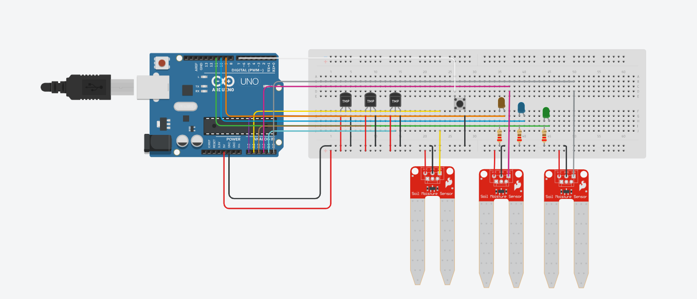

💧 Irrigação Automática com ESP32, ThingsBoard e WhatsApp
Este projeto implementa um sistema de irrigação automática inteligente utilizando um ESP32, com integração à plataforma ThingsBoard para monitoramento remoto e envio de notificações via WhatsApp (CallMeBot API).

🔧 Funcionalidades:
📶 Conexão Wi-Fi automática e reconexão em caso de queda;
🌡️ Leitura de temperatura e umidade do solo para até 3 grupos de sensores;
💡 Lógica de irrigação automática com base em faixas ideais de temperatura e umidade;
🔘 Botão físico para irrigação manual temporizada (10 segundos);
📈 Envio periódico de dados para o ThingsBoard em formato JSON;
📲 Envio de alertas via WhatsApp sempre que a irrigação automática for ativada.

⚙️ Componentes Utilizados
- ESP32
- Sensores analógicos de temperatura e umidade (1 por grupo)
- Relés ou atuadores para controle de irrigação
- Botão físico

Conexão com:
- ThingsBoard
- CallMeBot WhatsApp API

📤 Telemetria Enviada para ThingsBoard
- temp_1, temp_2, temp_3 → temperaturas por grupo
- umid_1, umid_2, umid_3 → umidades por grupo

🚨 Exemplo de Notificação WhatsApp
- Grupo 2: IRRIGACAO ON (T=29.3°C U=45.2%)

link do Projeto no Wokwi: https://wokwi.com/projects/429318669164524545

