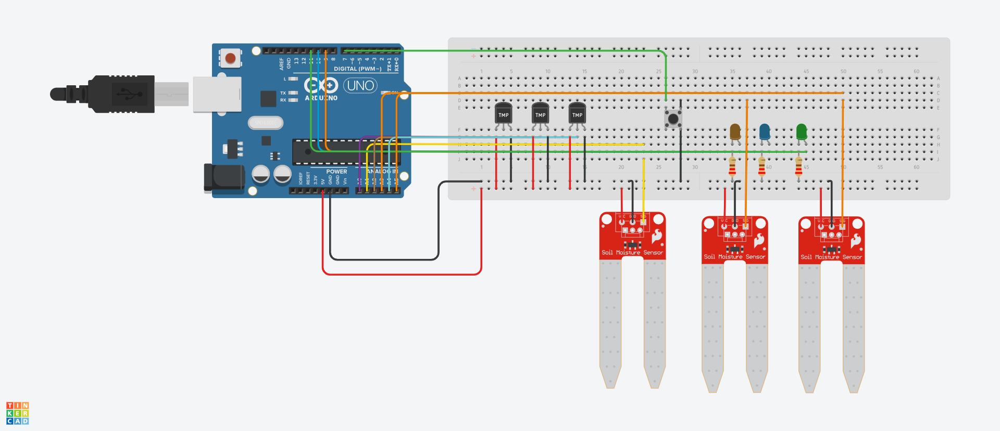

# Sistema_de_Irrigacao_Automática
Este projeto automatiza a irrigação de três grupos de plantas, utilizando sensores de temperatura e umidade do solo. O sistema ativa a irrigação automaticamente quando as condições ideais não são atendidas e permite o controle manual através de um botão.

link do Projeto no Tinkercad: https://www.tinkercad.com/things/lcnjxmGM0bt-trabalhoiot?sharecode=-TLdss7GQk_40DcfDZXLK7kFEuZRxNQ64j-uSBTIKb8

