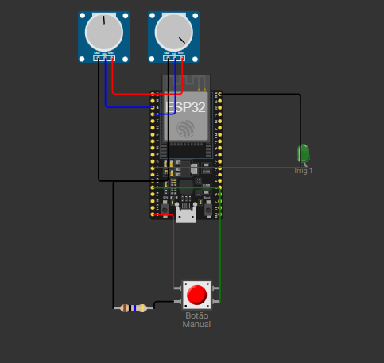

💧 Irrigação Automática com ESP32, ThingsBoard e WhatsApp (Simulação com Potenciômetros)

- Este projeto apresenta um sistema de irrigação automática inteligente utilizando um ESP32, com simulação de sensores via potenciômetros, integração com o ThingsBoard para monitoramento remoto e envio de alertas via WhatsApp, utilizando a API do CallMeBot.

🧪 Simulação com Potenciômetros

Cada grupo de irrigação possui dois potenciômetros:

- Um simula a temperatura

- Outro simula a umidade do solo

🔧 Funcionalidades:

📶 Conexão automática à rede Wi-Fi e reconexão automática;

🌡️ Leitura de temperatura e umidade simuladas para até 3 grupos;

🤖 Controle automático da irrigação com base em limites configuráveis;

🔘 Botão físico para ativar irrigação manual por 10 segundos;

📈 Envio de dados para o ThingsBoard (plataforma IoT);

📲 Notificações no WhatsApp sempre que a irrigação automática é ativada.

⚙️ Componentes Utilizados:

- ESP32
- 2 potenciômetros (1 para temperatura, 1 para umidade)
- 1 saídas de controle (simulando bombas/relés)
- 1 botão físico
- 1 resistor de 10MΩ

Integração com:

- ThingsBoard
- CallMeBot WhatsApp API

📤 Dados Enviados ao ThingsBoard:

- temp_1, temp_2, temp_3 → temperaturas simuladas (via potenciômetro)
- umid_1, umid_2, umid_3 → umidades simuladas (via potenciômetro)

🚨 Exemplo de Notificação WhatsApp:

- Grupo 2: IRRIGACAO ON (T=00.0°C U=00.0%)

link do Projeto no Wokwi: https://wokwi.com/projects/429318669164524545

